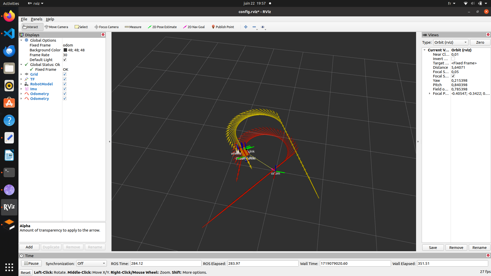

# Mobile Robot localisation

This repository extends the [Mobile-robot-simulation-ROS repository](https://github.com/ChehabiMed/Mobile-robot-simulation-ROS) by implementing advanced localization techniques. Here, we fuse wheel odometry and IMU data using the UKF (Unscented Kalman Filter) provided by the robot_localization package to achieve more precise localization of our robot.


Yellow: the filtered trajectory. Red: the wheel odometry trajectory.

## Overview

In this extension, we enhance the existing mobile robot simulation with:

- **Wheel Odometry and IMU Data Fusion**: Combining data from the wheel odometry and IMU using the UKF to improve localization accuracy.
  
- **Improved Localization**: Utilizing the `robot_localization` package to achieve more precise and reliable robot positioning.

## Setup

To get started with this enhanced simulation, ensure you have the following prerequisites installed:

- ROS Noetic
- Gazebo
- Rviz
- `robot_localization` package

Clone this repository into your ROS workspace and build it:

```bash
cd ~
git clone https://github.com/ChehabiMed/mobile-robot-localization-ROS
cd ~/catkin_ws
catkin_make 
source devel/setup.bash
```

## Running the Simulation

Launch the localization simulation environment:

```bash
roslaunch my_robot_localization start_filter.launch 
```

## Future Enhancements

Future updates may include:

- Adding stereo camera plugin and extracting visual odometry to fuse with existing data.
- Building a map using stereo vision.
- Enhancing the robot's appearance with detailed 3D models.

## Contributing

Contributions to this repository are welcome! If you have suggestions, improvements, or bug fixes, feel free to open an issue or submit a pull request.

## License

This project is licensed under the BSD 2-Clause "Simplified" License. See the LICENSE file for details.
